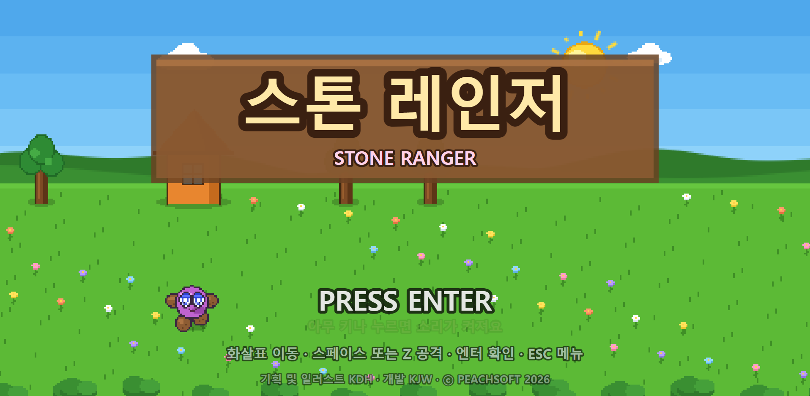
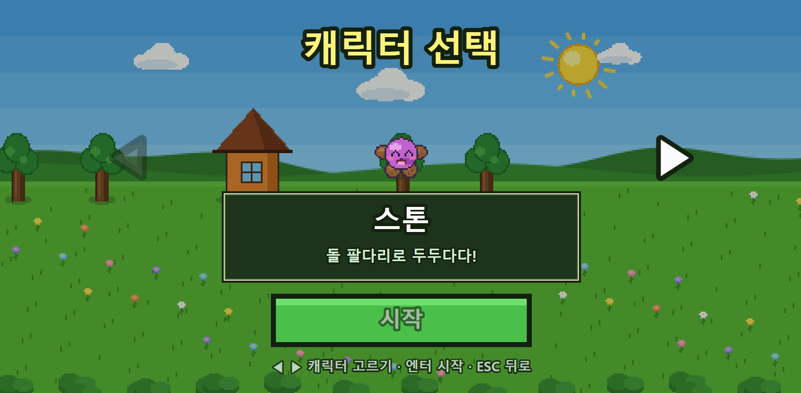
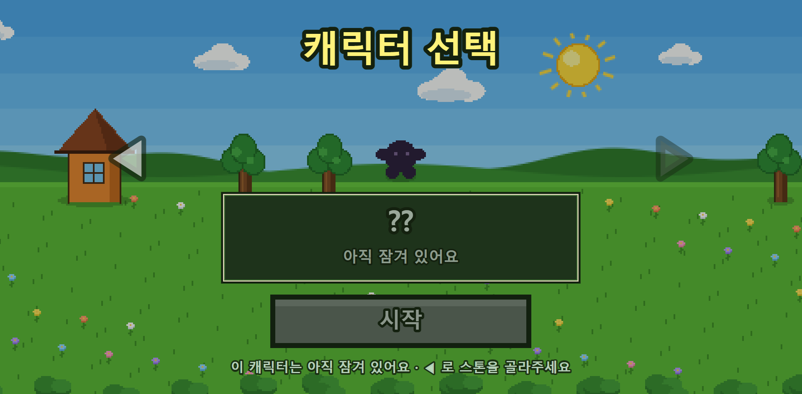
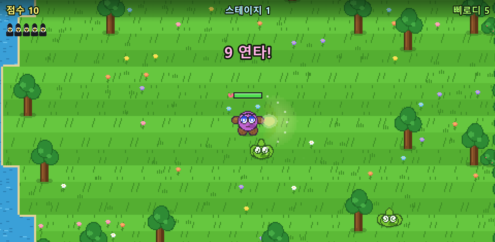
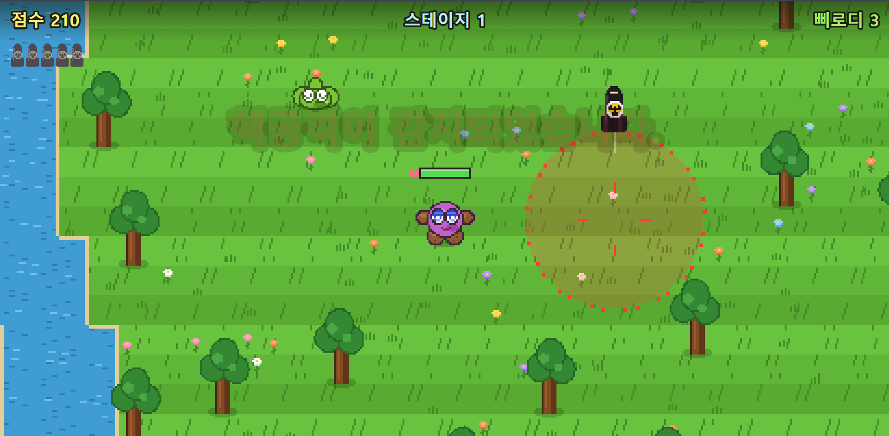
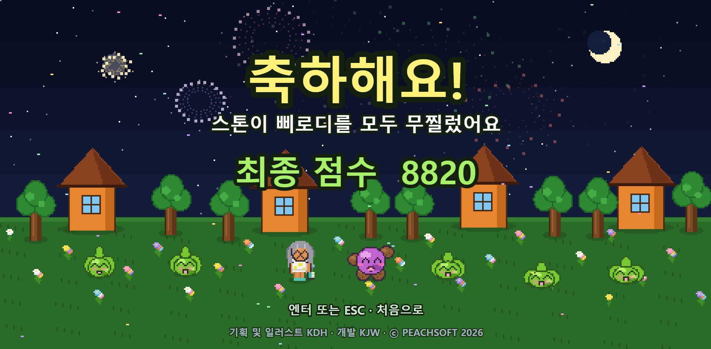

# 스톤 레인저 (STONE RANGER)

> **귀여운 스톤이 공원을 산책하다가 마주치는 액체괴물 삐로디들을 모두 물리치는 모험을
> 여러분도 함께 해보세요. 마지막 스테이지에서 최종보스를 만나 무찔러보세요.**

<p align="center">
  <a href="https://rokag3-gb.github.io/StoneRanger/">
    
  </a>
</p>

<p align="center">
  <a href="https://rokag3-gb.github.io/StoneRanger/"><b>https://rokag3-gb.github.io/StoneRanger/</b></a><br>
  <sub>설치 없이 브라우저에서 바로 시작됩니다 · 새 탭으로 열려면 <kbd>Ctrl</kbd>(맥은 <kbd>⌘</kbd>) + 클릭</sub>
</p>

[](https://rokag3-gb.github.io/StoneRanger/)

초등학교 2학년 아이가 게임 이름을 짓고 캐릭터와 배경을 직접 그렸습니다.
설치할 것도, 내려받을 것도 없습니다. **브라우저만 있으면 바로 플레이**할 수 있습니다.

<br>

# 게임 소개

<p align="center">
  <kbd>←</kbd> <kbd>↑</kbd> <kbd>↓</kbd> <kbd>→</kbd> <b>이동</b>
  &nbsp;·&nbsp; <kbd>Space</kbd> <b>공격</b>
  &nbsp;·&nbsp; <kbd>Enter</kbd> <b>핵폭탄</b>
  &nbsp;·&nbsp; <kbd>ESC</kbd> <b>메뉴</b>
</p>

## 🌿 어느 평화로운 공원에서

해가 비추는 넓은 공원. 잔디밭 사이로 시냇물이 흐르고 꽃이 피어 있습니다.
스톤이 늘 하던 대로 산책을 나섰는데, 오늘은 뭔가 이상합니다.

**PRESS ENTER** — 모험이 시작됩니다.

<br>

## 🎮 캐릭터 선택

좌우 화살표로 캐릭터를 넘겨봅니다.
지금 고를 수 있는 건 **스톤** 한 명 — 돌 팔다리로 두두다다 때리는 우리의 주인공입니다.

옆에 서 있는 **`??`** 는 아직 잠겨 있습니다. 언젠가 만나게 될 새로운 캐릭터를 기대해주세요!

| 스톤 | ?? |
|:---:|:---:|
|  |  |

<br>

## ⚔️ 두두다다! 삐로디를 무찔러라

공원 곳곳에 초록 액체괴물 **삐로디**가 어슬렁거립니다.
가까이 다가오면 슬금슬금 달려드니 조심하세요. 몸이 닿으면 에너지가 깎입니다.

**스페이스를 연타하면 팔 → 다리 → 팔 → 다리**, 스톤이 진지한 표정으로 두두다다 몰아칩니다.
연타가 이어질수록 공격이 빨라지고 화면에 **연타 수**가 뜹니다.
상하좌우는 물론 **대각선 8방향** 어디로든 때릴 수 있습니다.



> 지도는 **매번 새로 생성**됩니다. 강이 흐르는 방향과 폭, 나무와 집의 자리,
> 삐로디가 나타나는 위치까지 플레이할 때마다 달라집니다.

<br>

## ☢️ 최후의 수단, 핵폭탄

도저히 안 되겠다 싶을 때는 **엔터**.

화면이 붉게 물들며 **"핵공격이 감지되었습니다."** 경보가 울리고,
0.8초 뒤 하늘에서 떨어진 폭탄이 표시된 범위를 통째로 날려버립니다.

단, **게임 전체에서 딱 5발.** 스테이지가 넘어가도 다시 채워지지 않으니 아껴 쓰세요.
남은 개수는 화면 왼쪽 위에 폭탄 아이콘으로 표시됩니다.



<br>

## 👑 그리고 최종 보스

스테이지 3에서 삐로디를 모두 쓰러뜨리면 — 사이렌이 세 번 울립니다.

**최종 보스 등장.**

스톤의 두 배 크기, 두 배 길이의 체력 막대를 단 최종보스가 걸어옵니다.
핵폭탄으로도 한 방에 쓰러지지 않습니다. 끈질기게 버티고 공격하여 최종보스를 무찔러보세요.

<br>

## 🎆 엔딩

싸움이 끝나면 밤하늘에 불꽃이 피어오릅니다.
스톤도, 보스도, 그리고 이제는 친구가 된 삐로디들도 다 함께 웃습니다.



<br>

---

# 기술 스택

빌드 도구도, 프레임워크도, 외부 라이브러리도 **하나도 쓰지 않았습니다.**
`git clone` 하고 열면 그대로 돌아갑니다.

|항목|설명|
|---|---|
| **언어** | 순수 JavaScript (ES 모듈), HTML5 |
| **렌더링** | Canvas 2D -> 스프라이트 이미지 없이 **모든 그래픽을 코드로 직접 그립니다** |
| **사운드** | Web Audio API -> 배경음악과 효과음을 **파형부터 합성**합니다 (음원 파일 0개) |
| **서버** | Node.js 표준 모듈만 쓴 정적 서버 (`server.js`) |
| **의존성** | **없음** (`node_modules` 자체가 없습니다) |

### 화면이 그려지는 방식

1. 낮은 해상도(약 480×270)의 **가상 캔버스**에 도트 그림을 그리고
2. **정수 배율**로 확대해 실제 캔버스에 붙인 다음 (그래서 도트가 안 깨집니다)
3. 그 위에 한글 글자를 **원래 해상도**로 그립니다 (그래서 글자가 또렷합니다)

창 크기가 바뀌면 배율과 가상 해상도를 다시 계산해서 여백 없이 화면을 꽉 채웁니다.

<br>

---

# 플레이 가이드

## 실행하기

`실행.bat` 을 더블클릭하면 서버가 뜨고 브라우저가 자동으로 열립니다.

직접 실행하려면:

```
node server.js
```

그리고 브라우저에서 http://localhost:5173 으로 들어갑니다.

> 파이썬만 있어도 됩니다: `python -m http.server 5173` 후 같은 주소로 접속.
> (`file://` 로 index.html 을 바로 열면 브라우저 보안 정책 때문에 동작하지 않습니다)

## 조작법

| 키 | 하는 일 |
|---|---|
| ← → ↑ ↓ | 이동 (동시에 눌러 대각선 이동 가능) |
| 스페이스 · **Z** · **X** · 숫자패드 0 | 공격. 연타하면 팔 → 다리 → 팔 → 다리 두두다다. 꾹 눌러도 계속 나갑니다 |
| **엔터** | 플레이 중에는 **핵폭탄**. 메뉴에서는 확인 / 시작 / 다음 |
| ESC | 일시정지 메뉴 열기·닫기 |

> **공격 키가 4개인 이유**
> 값싼 키보드는 한 번에 인식할 수 있는 키 수에 한계가 있습니다(키 고스팅).
> 그래서 **방향키 2개를 누른 채로 스페이스를 누르면 스페이스가 통째로 무시되는** 경우가 흔합니다.
> 키보드 회로상 스페이스와 멀리 떨어진 `Z` / `X` / `숫자패드 0` 도 공격 키로 열어뒀으니,
> 대각선으로 달리면서 때릴 때 스페이스가 안 먹으면 **Z 를 써보세요.**

## 게임 흐름

```
인트로 → 캐릭터 선택 → 스테이지 1 → 2 → 3 → 최종 보스 "엄마" → 엔딩
                                      └ 에너지 0 → 게임 오버
```

- 스테이지별 삐로디: **5 / 15 / 20마리**. 올라갈수록 빠르고 더 자주 달려듭니다.
- 스테이지별 지도 크기: **45×45 / 50×50 / 55×55 타일** (한 칸 16px)
- 점수: 때리면 +10, 처치하면 +100, 스테이지 클리어 +500, 보스 처치 +2000
- 에너지 100에서 시작, 삐로디에 닿으면 −10. 다음 스테이지로 가면 100으로 완충됩니다.
- 시냇물은 지나갈 수 있지만 속도가 느려집니다.
- 캐릭터(스톤·삐로디·엄마)는 **나무나 집에 끼지 않습니다.** 넉백 등으로 지형지물 안에
  파묻히면 가장 가까운 빈 자리로 자동으로 밀려납니다.
- **강은 매번 다르게 흐릅니다** — 스테이지가 열릴 때마다 가로/세로 방향, 기울기,
  구불거리는 정도, 폭을 새로 뽑습니다. 스톤은 항상 마른 땅에서 시작합니다.

### 핵폭탄

게임을 처음 시작할 때 **5개**를 받고, **스테이지가 넘어가도 다시 채워지지 않습니다**
(에너지는 완충되지만 핵폭탄은 계속 차감).

엔터를 누르면 바라보는 방향의 **일반 공격 범위 바로 바깥**에 떨어집니다.
**조준 원 · 폭발 그림 · 실제 데미지 범위는 모두 정확히 같은 크기**입니다.

> 0.8초의 텀 동안 삐로디는 계속 움직입니다. 몰려 있을 때 노려야 제값을 합니다.
> 텀과 반경은 `src/config.js` 의 `NUKE.delay` / `NUKE.radius` 로 조절합니다.

### 최종 보스 "엄마"

| | 값 | 비고 |
|---|---|---|
| 체력 | 18대 | 머리 위 막대 (스톤 막대의 2배 길이) |
| 크기 | 스톤의 2배 | |
| 이동 속도 | 72 | 스톤(90)보다 20% 느립니다 |
| 행동 | 쫓아오기 ↔ 쉬기 / 배회 | 계속 따라붙지 않고 중간중간 숨 돌릴 틈을 줍니다 |
| 접촉 피해 | 10 | 삐로디와 동일 |
| 핵폭탄 피해 | 6 | 보스는 핵폭탄으로도 한 방에 죽지 않습니다 |

보스는 **쫓아오기(1.4~2.4초) → 잠깐 쉬기(0.5~1.0초) 또는 엉뚱한 데로 걷기(1.0~1.8초)** 를 반복합니다.
배회하는 동안에도 0.4~0.8초마다 방향을 틀어서 부지런히 돌아다닙니다.
쉬는 동안에는 머리 위에 점 세 개가 깜빡여서 "지금은 안 쫓아온다"는 걸 알 수 있습니다.

> 더 쉽게/어렵게 하려면 `src/config.js` 의 `BOSS.speed`, `BOSS.restChance`,
> `BOSS.chaseTime` / `restTime` / `wanderTime`, `BOSS.hp` 를 조절하세요.

<br>

---

# 만지작거리기

## 숫자 바꾸기

밸런스 상수는 전부 **`src/config.js`** 한 곳에 모여 있습니다.
지도 크기, 이동 속도, 삐로디 마릿수와 민첩함, 점수, 에너지까지 여기서 바꾸고 새로고침하면 바로 적용됩니다.

```js
STONE: {
  speed: 90,        // 스톤 이동 속도
  hitRange: 45,     // 공격이 닿는 거리
},
STAGES: [
  // 스테이지마다 지도 크기(mapW/mapH)와 난이도를 따로 정합니다
  { count: 5,  speed: 59, chase: 0.12, mapW: 45, mapH: 45 },
  { count: 15, speed: 68, chase: 0.38, mapW: 50, mapH: 50 },
  { count: 20, speed: 80, chase: 0.68, mapW: 55, mapH: 55 },
],
```

브라우저 콘솔에서 `StoneRanger.CFG` 로 실시간으로도 만져볼 수 있습니다.

## 소리

배경음악과 효과음은 **코드로 직접 합성**합니다 (Web Audio API). 음원 파일이 없어도 바로 소리가 납니다.

- **인트로 / 캐릭터 선택**: 통통 튀는 귀여운 팝 (오리지널)
- **게임 플레이 중**: 전래동요 **「열 꼬마 인디언」**(1868년 곡, 저작권 만료)을 8비트로 편곡
- **엔딩**: 불꽃놀이에 어울리는 신나는 축하곡 (오리지널)
- **게임 오버**: 짧게 툭 떨어지고 끝나는 오락실식 징글 (오리지널, **반복하지 않고 한 번만** 울립니다)
- **효과음**: 푹 · 퍽 · 푸슉 · 삐흉 · 샤샥 타격음 5종, 처치음 "삐흉탁", 핵 경보 사이렌, 폭발음

페이지를 열자마자 바로 재생을 시도합니다. 다만 브라우저 자동재생 정책 때문에
**처음 방문한 브라우저에서는 첫 키를 누르는 순간** 소리가 켜질 수 있습니다.

### 내 음원 파일로 바꾸기

`assets/audio/` 에 아래 이름으로 파일을 넣고 **새로고침**하면 합성음 대신 그 파일이 재생됩니다.
확장자는 **mp3 · ogg · wav · m4a** 중 아무거나 되고, 먼저 찾은 것을 씁니다.

| 파일 이름 | 언제 나오는지 | 반복 |
|---|---|---|
| `intro.mp3` | 인트로 · 캐릭터 선택 · 엔딩 | 반복 |
| `battle.mp3` | 스테이지 플레이 중 | 반복 |
| `gameover.mp3` | 게임 오버 | 한 번만 |

지금 어떤 곡이 파일이고 어떤 곡이 합성음인지는 **브라우저에서 F12 → Console** 을 열면 표로 나옵니다.

## 파일 구조

```
index.html          캔버스 하나
server.js           의존성 없는 로컬 서버
src/
  config.js         ★ 게임 밸런스 숫자 모음
  main.js           화면 설정 + 메인 루프
  state.js          공유 상태와 화면 전환
  input.js          키보드 (동시 입력 지원)
  audio.js          8비트 사운드 합성
  sprites.js        도트 그림 (스톤 · 삐로디 · 엄마 · 나무 · 집 · 핵폭탄)
  scenery.js        인트로 배경 풍경
  world.js          지도 생성 / 충돌 / 화면 그리기
  stone.js          주인공
  pirodi.js         적
  boss.js           최종 보스 "엄마"
  ui.js             글자와 창
  scenes/           intro · select · play · clear · gameover
assets/             아이가 그린 원본 그림 + 게임 화면 캡처
```

<br>

---

기획 및 일러스트 **KDH** · 개발 **KJW** · ⓒ PEACHSOFT 2026
